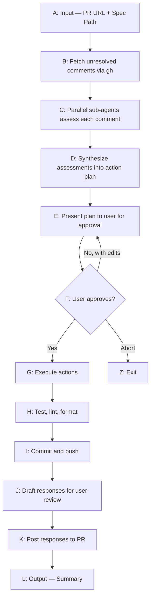

# PR Review Handler

Systematically processes PR review comments: assesses each piece of feedback, creates a coherent action plan, implements changes, and responds to reviewers.

---

## Flow



---

## Input

- **PR URL**: GitHub PR URL (e.g., `https://github.com/org/repo/pull/123`)
- **Spec file path**: Path to the spec being implemented (provides intent context)

---

## Step 1: Fetch Comments

Run the `fetch-comments.sh` script from the same directory as this SKILL.md:

```bash
bash <plugin_dir>/fetch-comments.sh <PR_URL>
```

This script uses the GitHub **GraphQL API** (the only way to get `isResolved` status on review threads). It handles pagination and outputs structured JSON to stdout.

### Output Format

```json
{
  "pr": {
    "number": 123,
    "state": "OPEN",
    "title": "Feature X",
    "url": "https://github.com/org/repo/pull/123",
    "headRefName": "feature/x",
    "baseRefName": "main"
  },
  "unresolvedThreads": [
    {
      "id": "PRRT_abc123",
      "path": "src/foo.ts",
      "line": 42,
      "startLine": null,
      "diffSide": "RIGHT",
      "isOutdated": false,
      "firstCommentDatabaseId": 12345678,
      "comments": [
        {
          "databaseId": 12345678,
          "body": "This needs a null check",
          "author": "reviewer1",
          "createdAt": "2026-04-10T12:00:00Z",
          "diffHunk": "@@ -40,6 +40,8 @@..."
        }
      ]
    }
  ],
  "topLevelComments": [
    {
      "databaseId": 87654321,
      "body": "Overall looks good but...",
      "author": "reviewer2",
      "createdAt": "2026-04-10T11:00:00Z"
    }
  ],
  "reviewBodyComments": [
    {
      "databaseId": 11111111,
      "body": "Something broke with the transition...",
      "state": "CHANGES_REQUESTED",
      "author": "reviewer2",
      "createdAt": "2026-04-10T09:00:00Z"
    }
  ],
  "meta": {
    "totalThreads": 15,
    "unresolvedThreads": 5,
    "resolvedThreads": 10,
    "topLevelComments": 3,
    "reviewBodyComments": 1
  }
}
```

### Key fields for later steps

- **`firstCommentDatabaseId`** on each thread — the ID needed to post replies via REST API (used in Step 8)
- **`path`** and **`line`** — file location for reading the relevant code
- **`isOutdated`** — true if the code has changed since the comment was made; see Step 2 for handling
- **`comments`** array — contains the full conversation thread. Check for prior responses (especially ones starting with `🤖 *Addressed via Claude Code*`) to avoid re-handling work that's already been done
- **`topLevelComments`** — general PR discussion not tied to specific code lines; these need assessment too (see Step 2)
- **`reviewBodyComments`** — the high-level text reviewers write when submitting a review (e.g., "Changes requested: ..."). These often contain important feedback like bug reports or blocking concerns that aren't tied to specific code lines. Easy to miss — always check these

---

## Step 2: Assess Comments

### Pre-assessment: Triage for prior responses

Before doing detailed assessment, scan each thread's `comments` array for existing responses. A thread has already been handled if:
- It has a reply starting with `🤖 *Addressed via Claude Code*` (from a prior run of this skill)
- The reviewer has NOT posted further objections after that reply

Threads that were previously addressed but have new reviewer follow-ups after the response DO still need assessment — the follow-up is the thing to assess, not the original comment.

This triage matters because PRs often go through multiple review rounds. Re-handling already-addressed threads wastes time and can produce confusing duplicate responses.

### Assessing threads that need it

Spawn a sub-agent for each thread that wasn't filtered out by triage. Each sub-agent receives:
- The comment thread (full context)
- The relevant code snippet
- The spec file (for understanding intent)
- Other comments on the same file (for awareness)

**Verify factual claims.** When a reviewer makes a factual assertion (e.g., "this API doesn't exist", "this method is deprecated", "this will crash"), check the actual source code or documentation before accepting it. Reviewers — including automated ones like Copilot — can be wrong. Read the relevant source, check type definitions, or look at upstream docs. Getting this right avoids making unnecessary changes or introducing regressions based on incorrect claims.

**Handle outdated threads.** If `isOutdated` is true, the code has changed since the comment was made. Read the current code at the relevant path — the issue may have already been fixed by subsequent commits even though no one replied to the thread. Flag outdated threads in the action plan so the user knows which comments refer to stale code.

### Assessment Output

Each sub-agent returns one of:

**1. Needs Action**
```yaml
assessment: needs-action
summary: "Reviewer is right — we're not handling the null case"
suggested_fix: "Add null check before accessing user.profile"
file: "src/components/UserCard.tsx"
lines: [42, 45]
effort: trivial | small | medium  # helps prioritize
outdated: false  # true if isOutdated — flag in plan
```

**2. Needs Discussion**
```yaml
assessment: needs-discussion
summary: "Reviewer suggests Redux but spec explicitly chose Zustand"
reason: "unclear" | "disagrees-with-spec" | "out-of-scope" | "subjective"
suggested_response: "The spec chose Zustand for X reason. Happy to discuss if you feel strongly."
outdated: true  # flag so user knows this refers to stale code
```

**3. Already Resolved**
```yaml
assessment: already-resolved
summary: "This was fixed in a subsequent commit"
evidence: "Commit abc123 added the missing validation"
suggested_response: "Addressed in abc123 — added validation for empty arrays."
```

**4. Previously Addressed**
```yaml
assessment: previously-addressed
summary: "A prior Claude Code run already responded to this"
evidence: "Reply from @author on 2026-04-01 starts with '🤖 *Addressed via Claude Code*' — explained the file was not deleted. No reviewer follow-up."
```

Include the `outdated` field on every needs-action and needs-discussion assessment. When `outdated: true`, add `[OUTDATED]` to the action/discussion entry in the plan — this tells the user the comment refers to code that has since changed, so the fix may already be in place or the suggestion may no longer apply.

### Top-Level and Review Body Comments

Don't skip `topLevelComments` or `reviewBodyComments` — these contain PR-level feedback not tied to specific code lines.

**`reviewBodyComments`** are the text reviewers write when submitting a review (the "Changes requested" or "Approved" message). These frequently contain the most important feedback — bug reports, blocking concerns, or high-level design objections. A reviewer might write "Something also broke with the transition animation" in the review body while their inline comments focus on specific code issues. Missing the review body means missing the big picture.

**`topLevelComments`** are general PR discussion (issue-level comments). These include human feedback, CI bot reports, and test trigger commands.

For both, assess:
- Has the item been addressed in a subsequent comment or commit?
- Does it require investigation or a code change?
- Is it informational only (CI reports, bot messages)?

---

## Step 3: Synthesize Action Plan

A single agent reviews all assessments to create a coherent plan. This is critical because:
- Multiple comments may affect the same code
- Reviewer suggestions may conflict with each other
- Changes need to be atomic and not break each other

### Conflict Detection

Identify and flag:
- **Same-code conflicts**: Two comments suggest different changes to the same lines
- **Reviewer disagreements**: Reviewer A says X, Reviewer B says Y
- **Spec conflicts**: Suggestion contradicts spec intent

### Plan Format

```markdown
## PR Review Action Plan

**PR**: #123 — Feature X
**Comments**: 12 total (5 need action, 2 need discussion, 1 already resolved, 3 previously addressed, 1 top-level)

### Actions (in execution order)

- [ ] **Action 1**: Add null check in UserCard.tsx:42
      Comment by @reviewer1 — "Missing null safety"
      Effort: trivial

- [ ] **Action 2**: Extract validation logic to shared util
      Comment by @reviewer2 — "This pattern is duplicated"
      Effort: small
      Related: Also addresses @reviewer1's comment on line 87

### Discussions (need your input)

- [ ] **Discussion 1**: Redux vs Zustand
      @reviewer3 suggests switching to Redux
      Spec explicitly chose Zustand (see Architecture section)
      **Draft response**: "We went with Zustand per the spec because..."
      **Your call**: Respond as drafted / Modify / Actually switch

### Conflicts Detected

- **Lines 50-55 of api.ts**: @reviewer1 wants try/catch, @reviewer2 wants Result type
  **Recommendation**: Use Result type (cleaner, matches spec's error handling approach)
  **Your call**: Result type / Try-catch / Discuss with reviewers

### Already Resolved

- @reviewer1's comment on missing tests — addressed in commit abc123

### Previously Addressed (by prior Claude Code runs)

- 3 threads have existing responses with no reviewer follow-up
  Recommend: ask reviewer to resolve these threads on GitHub

### Top-Level Items

- ⚠️ @reviewer2 reported a transition flash bug (Apr 1) — not yet addressed
  **Needs investigation**: check transition animation between steps
```

---

## Step 4: User Approval

Present the plan and wait for user input:

- **Approve all**: Proceed with plan as-is
- **Edit**: User modifies checkboxes, draft responses, or conflict resolutions
- **Abort**: Exit without changes

User can also add notes like "skip action 2 for now" or "change the response tone."

---

## Step 5: Execute Actions

For each approved action:

1. Make the code change
2. Verify change doesn't break related code
3. Track what was changed for commit message

Execute in dependency order if actions are related.

---

## Step 6: Quality Checks

For each service/app that was modified:

```bash
# Run in each affected service directory
npm run lint --fix  # or equivalent
npm run format      # or equivalent  
npm run test        # run affected tests
```

If checks fail:
- Attempt auto-fix for lint/format issues
- For test failures, pause and notify user

---

## Step 7: Commit and Push

### Commit Message Format

```
address PR review feedback (#123)

Actions taken:
- Add null check in UserCard.tsx
- Extract validation to shared util
- Fix typo in error message

Resolves review comments from: @reviewer1, @reviewer2
```

### Push

```bash
git push origin [branch-name]
```

---

## Step 8: Post Responses

### Response Prefix

Every response posted to the PR must start with this prefix — no exceptions:
```
🤖 *Addressed via Claude Code*

```
This prefix is how future runs of this skill identify threads that have already been handled (see Step 2 triage). Omitting it breaks the detection loop for subsequent runs.

### Draft Review Before Posting

Show user all drafted responses before posting:

```markdown
## Responses to Post

**Thread 1** (@reviewer1 on UserCard.tsx:42):
> 🤖 *Addressed via Claude Code*
> 
> Good catch! Added null check — see latest commit.

**Thread 2** (@reviewer3 on architecture):
> 🤖 *Addressed via Claude Code*
> 
> We went with Zustand per the spec's architecture decision (see spec section 3.2). 
> The main drivers were bundle size and simpler mental model for this use case.
> Happy to discuss further if you have concerns!

[ Post All ] [ Edit ] [ Cancel ]
```

### Posting

Use the `reply-to-comment.sh` script from the same directory as this SKILL.md. It handles the correct API endpoint automatically.

**For review comment threads (most common)** — use `firstCommentDatabaseId` from fetch-comments.sh output:
```bash
bash <plugin_dir>/reply-to-comment.sh --thread <PR_URL> <firstCommentDatabaseId> "<response>"
```

**For top-level PR comments** — general discussion not tied to specific code:
```bash
bash <plugin_dir>/reply-to-comment.sh --top-level <PR_URL> "<response>"
```

Since this skill processes review comments on specific code lines, you will almost always use `--thread`. Using `--top-level` for review thread responses will incorrectly post to the main PR conversation instead of the thread.

---

## Output Summary

```markdown
## ✅ PR Review Handling Complete

**PR**: #123 — Feature X
**Branch**: feature/ENG-1234-user-ratings-feed

### Actions Completed
- ✅ Add null check in UserCard.tsx
- ✅ Extract validation to shared util
- ⏭️ Skipped: Redux migration (per user decision)

### Quality Checks
- ✅ Lint passed
- ✅ Format passed
- ✅ Tests passed (23 tests, 2 snapshots updated)

### Commit
`abc123` — "address PR review feedback (#123)"

### Responses Posted
- ✅ 5 comment threads responded to
- 📝 1 discussion pending (Redux vs Zustand — awaiting reviewer reply)

### Remaining
- 2 comments marked as won't-fix (per user decision)
```

---

## Configuration

| Option | Default | Description |
|--------|---------|-------------|
| `autoResolveThreads` | false | Automatically resolve threads after responding |
| `commitStrategy` | single | `single` (one commit) or `per-action` |
| `requireApproval` | true | Always require user approval before acting |
| `responsePrefix` | "🤖 *Addressed via Claude Code*" | Prefix for all PR responses |

---

## Edge Cases

### No unresolved comments
Exit early with "No unresolved comments found on this PR."

### All threads previously addressed
If every thread already has a Claude Code response with no reviewer follow-up, present a summary showing this and recommend the reviewer resolve the threads on GitHub. Don't draft new responses or make code changes.

### PR is merged
Exit with "PR is already merged. Comments cannot be addressed."

### Branch conflicts
Notify user: "Branch has conflicts with base. Please resolve before addressing comments."

### Rate limiting
If `gh` rate limits, pause and notify user with retry time.
