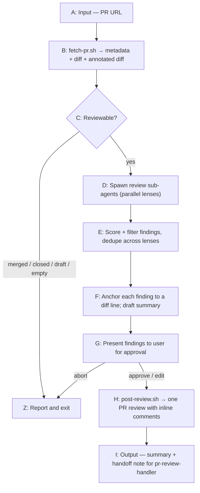

# PR Reviewer

Reviews a GitHub PR thoroughly and posts inline comments on the specific lines that have feedback. Built to run **before** `pr-review-handler`: this skill *generates* the review comments; `pr-review-handler` then *processes* them (assesses, implements fixes, replies).

## When to use this vs. the alternatives

- **`pr-reviewer` (this skill)** — review an arbitrary PR by URL, especially on **GitHub Enterprise**, and produce inline line-anchored comments you can then feed to `pr-review-handler`. Full control over the posted comments and the host.
- **`/code-review --comment`** (built-in) — lighter option when you're on **github.com** and already checked out on the PR's branch (it reviews your *current working diff*). It fans out many agents and carries a token-cost warning; prefer it for quick self-review, not for arbitrary/Enterprise PRs.

---

## Flow



---

## Input

- **PR URL**: e.g. `https://github.com/org/repo/pull/123`. GitHub Enterprise Server hosts work too (`https://github.mycompany.com/org/repo/pull/123`); the scheme is optional. The host is inferred and passed to `gh api --hostname`, so no extra config — you just need to be authenticated to that host (`gh auth login --hostname <host>`).

---

## Step 1: Fetch the PR

Run `fetch-pr.sh` from this skill's directory:

```bash
bash <plugin_dir>/fetch-pr.sh <PR_URL>
```

It emits a single JSON object: `pr` (metadata incl. `headSha`, `state`, `isDraft`, `merged`), `files` (changed-file list with add/del counts), `diff` (raw unified diff), and `annotatedDiff`.

**`annotatedDiff` is the key to correct anchoring.** Each diff line is prefixed with an `old new` line-number gutter, e.g.:

```
   40    42 +  if (user == null) return;
   41    43    doThing(user);
```

The **right-hand number** is the line to anchor a `RIGHT`-side comment to. GitHub only accepts inline comments on lines that appear in the diff — using the annotated numbers is how you avoid comments getting silently dropped at post time.

### Reviewability gate

Before reviewing, check `pr` and stop early (report, don't post) if:
- `merged: true` → "PR is already merged."
- `state` is `CLOSED` → "PR is closed."
- `isDraft: true` → ask the user whether to review a draft before proceeding.
- No changed files / empty diff → "No changes to review."

---

## Step 2: Review with sub-agents

Spawn review sub-agents so the work is thorough and the main context stays clean. **Scale the fan-out to the PR size** — token cost should be proportional to the change, not fixed:

- **Small PR** (roughly ≤ ~150 changed lines, few files): a single review sub-agent covering all lenses is enough.
- **Larger PR**: fan out in parallel, one sub-agent per lens (and/or split by file group). Combine their findings in Step 3.

### Review lenses

Cover these angles (the checklist a strong human reviewer carries). Tell each sub-agent to focus on real, actionable problems — not to narrate everything:

1. **Correctness / bugs** — logic errors, off-by-one, null/undefined, wrong conditionals, broken invariants, incorrect API usage.
2. **Async / concurrency** — un-awaited promises (a call that returns a promise but isn't awaited), missing `await` before an early return, races, unhandled rejections, lost error propagation across async boundaries. These are easy to miss and high-impact — look specifically for a promise-returning call whose result is discarded.
3. **Resource management** — anything acquired that isn't released on every path: DB connections, file handles, locks, subscriptions, timers. A resource opened and never closed is a leak **regardless of what happens in between** — flag it even if you can't see the surrounding library's internals.
4. **Security** — injection (raw string interpolation into SQL/shell/HTML), auth/authz gaps, unsafe deserialization, secrets in code, unvalidated or unsanitized input, path traversal.
5. **Edge cases / error handling** — unhandled failures, empty/boundary inputs, missing rollback, swallowed errors (empty `catch`), off-by-one at boundaries.
6. **Tests** — missing coverage for the new/changed behavior, tests that don't actually assert the thing, brittle tests.
7. **Design / maintainability** — unnecessary complexity, duplication, leaky abstractions, misleading names, public API concerns.

### Give each sub-agent

- The PR title + body (intent).
- The `annotatedDiff` (so it can cite exact line numbers) and the raw `diff`.
- Permission and encouragement to **read the full files** (not just the diff) via `Read`/`gh api` — context beyond the ±3 diff lines is often what distinguishes a real bug from a false positive.

### Verify before flagging — but don't drop diff-evident issues

Reviewers — human and automated — are often wrong. When a finding rests on a claim about **something outside the diff** ("this helper doesn't exist", "this method is deprecated", "the caller already null-checks this"), confirm it against the actual source before reporting it. A confident-but-wrong comment wastes the author's time and erodes trust.

But do **not** let "I can't see the whole codebase" become a reason to stay silent about a problem that is **evident from the diff itself**. These stand on their own — flag them, and if some detail depends on code you can't see, say so in the comment rather than dropping it:

- A resource opened in the diff and never closed on some path → a leak, whatever the library does internally.
- A promise-returning call whose result is discarded / not awaited → a real async bug, even if you can't see the callee's signature.
- Raw user input interpolated into a SQL/shell string → injection, regardless of the driver.
- An empty `catch` that swallows an error → real, regardless of what threw.

The rule is: **verify claims about the unseen; never suppress issues the diff already proves.** When uncertain about a detail, write the comment *with* the caveat ("if `write` is async this loses data; either way `conn` is never closed") — that's far more useful to the author than silence.

### Finding schema

Each finding a sub-agent returns:

```yaml
path: "src/components/UserCard.tsx"
line: 42                 # right-side line number from annotatedDiff (or old-side if side=LEFT)
side: RIGHT              # RIGHT = added/current code (default); LEFT = removed code
severity: blocker | important | nit
category: correctness | async | resource | security | edge-case | tests | design
confidence: 0-100        # see rubric below
body: "Concise, specific, actionable. Explain the problem and suggest a fix."
# optional, for a multi-line range:
start_line: 40
start_side: RIGHT
```

---

## Step 3: Score, filter, and synthesize

A single pass (you, or a synthesis sub-agent for big PRs) turns raw findings into the review. This is where quality is won — an over-eager review that cries wolf is worse than none.

### What to keep vs. drop

The goal is a review that catches the **real bugs** without crying wolf. Two different bars, because the cost of a miss differs:

- **Correctness, async/concurrency, resource, and security issues** — keep these whenever they're plausible and grounded in the diff, even at moderate confidence. Missing a real leak, race, or injection is far more costly than one comment the author waves off — and remember the output feeds `pr-review-handler`, which re-assesses every comment and can dismiss the ones that don't hold up. When you're not fully sure, keep it but **state the uncertainty in the comment** rather than dropping it.
- **Style, naming, "consider extracting", missing-TTL, and other subjective/maintainability nits** — hold these to a high bar. Drop unless you're confident it genuinely matters or the user asked for a thorough nit pass. This is where over-eager reviews lose trust.

Rough confidence guide (0–100): below ~40 is a likely false positive or a pre-existing issue → drop. A real correctness/security/resource/async concern in the ~50+ range → keep, with any caveat noted. A subjective nit → keep only if ~80+ and clearly worth the author's attention.

### Always drop these (regardless of confidence)

- Anything a **linter / type-checker / compiler** would catch (imports, types, formatting, unused vars) — assume CI runs those.
- **Pre-existing** issues on lines this PR didn't change.
- Pedantic **nitpicks** a senior engineer wouldn't raise (unless the user asked for a thorough nit pass).
- Changes that are **intentional** and consistent with the PR's stated purpose.
- Findings anchored to lines **not present in the diff** — GitHub will reject them; either re-anchor to a changed line nearby or move the point into the summary body.

### Synthesize

- **Dedupe** findings that multiple lenses raised for the same line.
- **Resolve conflicts** (two lenses suggesting opposite changes) — pick one and note the trade-off in the comment.
- Draft a **summary body**: one-paragraph overall assessment + counts by severity. Keep it brief and specific; no emoji padding.

---

## Step 4: User approval

Show the user the drafted review before posting — the summary plus each inline comment with its `path:line` and severity:

```markdown
## Proposed review for #123 — Feature X

**Summary**: Solid overall; 2 blockers around null handling and 1 missing test.

**Inline comments (3):**
1. [blocker] src/UserCard.tsx:42 — `user` can be null here; guard before `.profile`.
2. [important] src/api.ts:88 — error from `fetchX` is swallowed; surface or log it.
3. [important] src/UserCard.test.tsx:— no test covers the null-user path added here.

[ Post as COMMENT ] [ Edit ] [ Cancel ]
```

Default review event is **`COMMENT`** (non-blocking) — appropriate for feeding `pr-review-handler`. Only use `REQUEST_CHANGES` if the user explicitly wants to block the PR.

---

## Step 5: Post the review

Write the approved findings to a JSON file (an array matching the finding schema) and the summary to a text file, then:

```bash
bash <plugin_dir>/post-review.sh <PR_URL> <findings.json> <summary.txt> [EVENT]
```

`post-review.sh` fetches the diff, **validates every finding's `(path, side, line)` against the lines GitHub will actually accept**, drops (and reports on stderr) any that don't match, and posts the rest as a single review pinned to the PR's head commit. This matters because the create-review API is all-or-nothing — one bad anchor otherwise rejects the entire review. If it reports drops, re-anchor those findings using the `annotatedDiff` and re-run, or fold them into the summary.

---

## Output

```markdown
## ✅ PR Review Posted

**PR**: #123 — Feature X (github.mycompany.com/org/repo)
**Review**: COMMENT — 3 inline comments + summary
- [blocker] src/UserCard.tsx:42 — null guard
- [important] src/api.ts:88 — swallowed error
- [important] src/UserCard.test.tsx — missing null-path test

**Next step**: Run `pr-review-handler` on this PR to assess, implement, and reply to these comments.
```

Since this skill exists to feed `pr-review-handler`, always end by pointing the user there.

---

## Configuration

| Option | Default | Description |
|--------|---------|-------------|
| `bugRecall` | high | Keep plausible correctness/async/resource/security issues even at moderate confidence (flag uncertainty in-comment). Set `strict` for high-precision-only. |
| `includeNits` | false | Include low-severity style/naming/maintainability nitpicks |
| `event` | COMMENT | `COMMENT` / `REQUEST_CHANGES` / `APPROVE` |
| `requireApproval` | true | Show the drafted review before posting |

---

## Edge cases

- **Re-running on the same PR** — this posts a new review each time; it does not dedupe against prior reviews. Mention any earlier automated review to the user and confirm before posting again.
- **Huge PR** — if the diff is very large, fan out by file group, and tell the user if you sampled rather than reviewed every file exhaustively (don't silently cap coverage).
- **No real issues found** — post a brief approving/neutral summary (or, with the user's ok, skip posting) rather than inventing nits.
- **Not authenticated to the host** — `fetch-pr.sh` will say so; run `gh auth login --hostname <host>`.
- **Binary / generated files** — skip; there's nothing useful to say inline.
